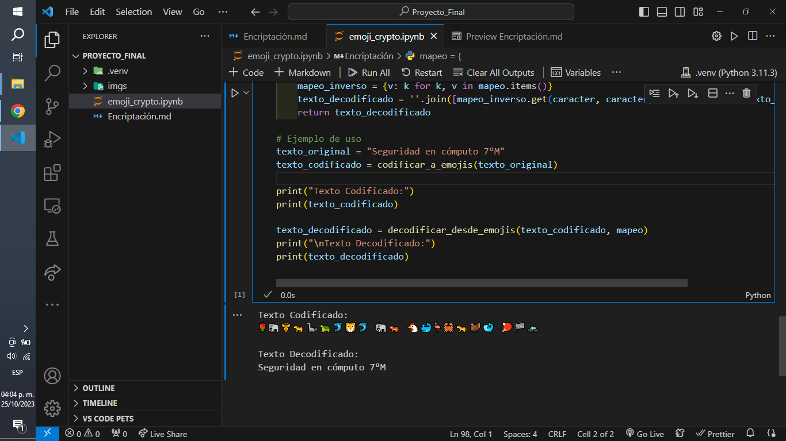

# Universidad Autónoma De Chiapas.

## Act. Propuesta de Encriptación.

### **Catedrático:** LIC. MARIANA PAOLA GONZALEZ SORIA.

### **Estudiante:** José Gilberto Guzmán Gutiérrez.

### LIDTS. 7ºM.

### A200119.

### Tuxtla Gutiérrez Chiapas. 25 de octubre del 2023.

# Tabla de datos.

| Carácter | Emoji |
| -------- | ----- |
| a        | 🦁    |
| á        | 🐹    |
| b        | 🐻    |
| c        | 🐔    |
| d        | 🐬    |
| e        | 🐘    |
| é        | 🦉    |
| f        | 🦊    |
| g        | 🦒    |
| h        | 🦔    |
| i        | 🐢    |
| í        | 🐥    |
| j        | 🦚    |
| k        | 🐨    |
| l        | 🦔    |
| m        | 🦩    |
| n        | 🐅    |
| ñ        | 🦜    |
| o        | 🐋    |
| ó        | 🐳    |
| p        | 🦀    |
| q        | 🐧    |
| r        | 🦕    |
| s        | 🐍    |
| t        | 🦃    |
| u        | 🐆    |
| ú        | 🦓    |
| v        | 🦐    |
| w        | 🦍    |
| x        | 🦏    |
| y        | 🦑    |
| z        | 🦎    |
| A        | 🚶    |
| Á        | 🚴    |
| B        | 🙆    |
| C        | 👨    |
| D        | 👩    |
| E        | 🧑    |
| É        | 🧔    |
| F        | 🧓    |
| G        | 🧔    |
| H        | 👴    |
| I        | 👵    |
| Í        | 👩‍⚕️    |
| J        | 👨‍⚕️    |
| K        | 👩‍⚕️    |
| L        | 👨‍🎓    |
| M        | 🚓    |
| N        | 👨‍🌾    |
| Ñ        | 👩‍🌾    |
| O        | 👨‍🎤    |
| Ó        | 💂    |
| P        | 👩‍🎤    |
| Q        | 👨‍🏫    |
| R        | 👩‍🏫    |
| S        | 🌹    |
| T        | 👩‍🏭    |
| U        | 👨‍💼    |
| Ú        | 👩‍💼    |
| V        | 🚶    |
| W        | 🙆    |
| X        | 😈    |
| Y        | 👤    |
| Z        | 👩‍🦳    |
| 1        | 🏀    |
| 2        | ⚽    |
| 3        | 🏈    |
| 4        | 🎾    |
| 5        | 🏐    |
| 6        | 🏉    |
| 7        | 🏓    |
| 8        | 🏸    |
| 9        | 🏒    |
| °        | 🏁    |
|          |       |

# Algoritmo.

    mapeo = {
        # --- LETRAS MINÚSCULAS::ANIMALES ---
        'a': '🦁',
        'á': '🐹',
        'b': '🐻',
        'c': '🐔',
        'd': '🐬',
        'e': '🐘',
        'é': '🦉',
        'f': '🦊',
        'g': '🦒',
        'h': '🦔',
        'i': '🐢',
        'í': '🐥',
        'j': '🦚',
        'k': '🐨',
        'l': '🦔',
        'm': '🦩',
        'n': '🐅',
        'ñ': '🦜',
        'o': '🐋',
        'ó': '🐳',
        'p': '🦀',
        'q': '🐧',
        'r': '🦕',
        's': '🐍',
        't': '🦃',
        'u': '🐆',
        'ú': '🦓',
        'v': '🦐',
        'w': '🦍',
        'x': '🦏',
        'y': '🦑',
        'z': '🦎',

        # --- LETRAS MAYÚSCULAS::PERSONAS ---
        'A': '🚶',
        'Á': '🚴',
        'B': '🙆',
        'C': '👨',
        'D': '👩',
        'E': '🧑',
        'É': '🧔',
        'F': '🧓',
        'G': '🧔',
        'H': '👴',
        'I': '👵',
        'Í': '👩‍⚕️',
        'J': '👨‍⚕️',
        'K': '👩‍⚕️',
        'L': '👨‍🎓',
        'M': '🚓',
        'N': '👨‍🌾',
        'Ñ': '👩‍🌾',
        'O': '👨‍🎤',
        'Ó': '💂',
        'P': '👩‍🎤',
        'Q': '👨‍🏫',
        'R': '👩‍🏫',
        'S': '🌹',
        'T': '👩‍🏭',
        'U': '👨‍💼',
        'Ú': '👩‍💼',
        'V': '🚶',
        'W': '🙆',
        'X': '😈',
        'Y': '👤',
        'Z': '👩‍🦳',

        # --- NÚMEROS::PELOTAS ---
        '1': '🏀',
        '2': '⚽',
        '3': '🏈',
        '4': '🎾',
        '5': '🏐',
        '6': '🏉',
        '7': '🏓',
        '8': '🏸',
        '9': '🏒',

        # --- EXTRA ---
        '°': '🏁',
        ' ': ' ',  # Espacio en blanco
    }

    def codificar_a_emojis(texto):
        texto_codificado = ''.join([mapeo.get(caracter, caracter) for caracter in texto])
        return texto_codificado

    def decodificar_desde_emojis(texto_codificado, mapeo):
        mapeo_inverso = {v: k for k, v in mapeo.items()}
        texto_decodificado = ''.join([mapeo_inverso.get(caracter, caracter) for caracter in texto_codificado])
        return texto_decodificado

    # Ejemplo de uso
    texto_original = "Seguridad en cómputo 7°M"
    texto_codificado = codificar_a_emojis(texto_original)

    print("Texto Codificado:")
    print(texto_codificado)

    texto_decodificado = decodificar_desde_emojis(texto_codificado, mapeo)
    print("\nTexto Decodificado:")
    print(texto_decodificado)

# Ejecución del código.

